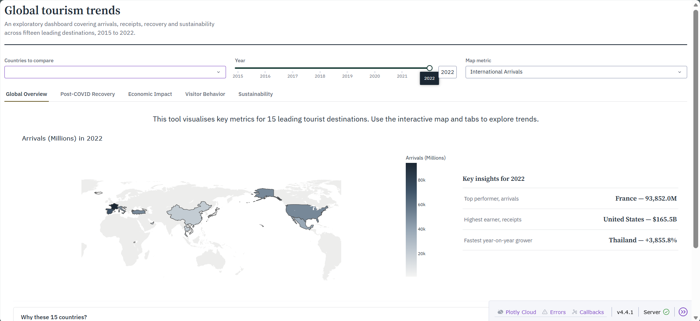
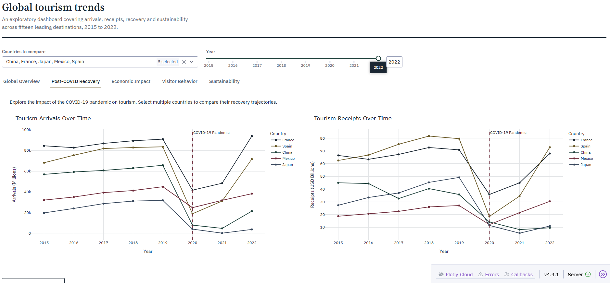
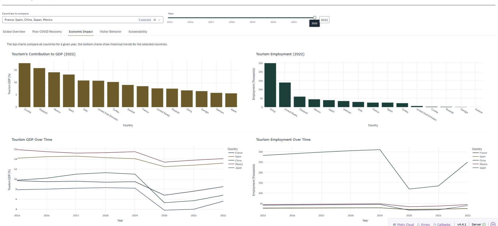
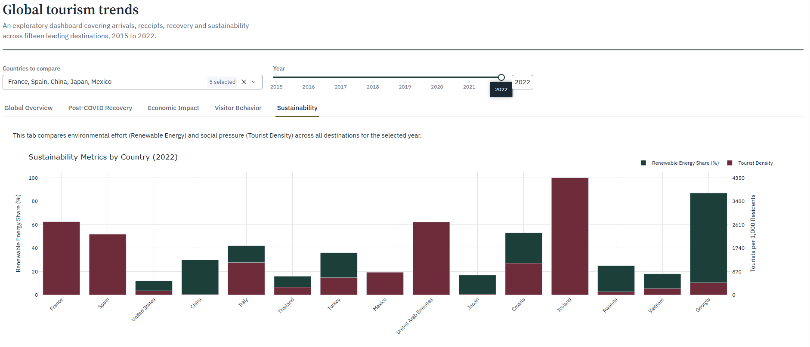

# Interactive Visualisation of Global Tourism Trends (2015–2022)

> **MSc Dissertation — Bangor University (2025–2026)**
> **MSc Artificial Intelligence and Data Science — Distinction**

> **Note:** The dashboard has been refined since the original dissertation submission, and this repository reflects the current version of the project.

An interactive web dashboard built with Python and Dash to help non-technical users explore international tourism data across countries and years.

This project was developed as an MSc dissertation using the **Five Design-Sheet (FDS)** methodology across four iterative prototypes, with formative evaluation at each stage using the **Critical Design Strategy (CDS)**.

---

## What It Does

The dashboard allows users to:

* Explore international tourism arrivals, receipts and economic indicators across 15 countries and 8 years (2015–2022)
* Compare post-COVID recovery trajectories using interactive line charts
* Examine tourism's contribution to GDP and employment by country and year
* Explore visitor behaviour and top source markets
* Compare sustainability measures such as renewable energy share and tourist density

Users can select countries and years and interact with the charts throughout the dashboard.

---

## Dashboard Screenshots

### Global Overview



### Post-COVID Recovery



### Economic Impact



### Sustainability



---

## Design Process

The dashboard was developed through four iterations using the **Five Design-Sheet (FDS)** methodology.

Each iteration involved reviewing the design and making changes to the layout, charts, navigation and presentation of information. The **Critical Design Strategy (CDS)** was used for formative evaluation throughout the process.

The design focused on making the dashboard understandable to users without a technical background, while still allowing them to explore relationships and trends in the data.

---

## Key Findings

* **Divergent recoveries:** France and Spain showed strong post-COVID recovery patterns, while Japan and China experienced slower recovery during the period covered by the dataset.
* **Mexico as an outlier:** Mexico maintained relatively high tourism arrivals during 2020–2021 compared with several other countries in the dataset.
* **Economic reliance:** Spain's tourism contribution to GDP was higher than France's during the period examined, indicating a greater economic reliance on tourism.

---

## Data Sources

* **UN World Tourism Organisation (UNWTO)** – international arrivals and receipts
* **World Bank** – GDP and employment figures
* **National tourism boards** – source market and length-of-stay data

---

## Data Preparation

The raw data required several cleaning and standardisation steps before it could be used in the dashboard.

* **Country name standardisation:** The value `'South'` appeared in source market columns as a truncated reference to South Korea. This was corrected explicitly rather than removing the affected records.
* **Missing values:** Numeric fields containing missing or unparseable values were handled before visualisation. Where appropriate, missing values were represented as `0` to avoid gaps in the time series.
* **Percentage parsing:** Source-country share values were provided as strings such as `"20%"` and converted to decimal proportions for use in the visualisations.
* **Data consistency:** Country names, dates and numerical fields were standardised across the different data sources.

---

## Visualisation and Interface Decisions

* A shared `get_chart_template()` function provides consistent styling across the dashboard.
* The COVID-19 pandemic year (2020) is marked on recovery charts to provide context for changes in tourism trends.
* Controls are shown according to the visualisation they affect, so users are not presented with irrelevant options.
* Interactive charts allow users to change countries and years without leaving the current view.

---

## Project Structure

```text
tourism-dashboard/
├── app.py
├── International Tourism Trends.csv
├── requirements.txt
└── README.md
```

---

## Installation and Usage

### 1. Clone the repository

```bash
git clone https://github.com/ogenelson/tourism-dashboard.git
cd tourism-dashboard
```

### 2. Install dependencies

```bash
pip install -r requirements.txt
```

### 3. Run the application

```bash
python app.py
```

### 4. Open the dashboard

Open the following address in your browser:

```text
http://127.0.0.1:8050
```

---

## Requirements

- Python 3.13
- Dash 4.0+
- Dash Bootstrap Components
- Plotly
- Pandas

## Tested With

- Python 3.13
- Dash 4.4.1

---

## Author

**Ogechi Nelson**
MSc Artificial Intelligence and Data Science, Bangor University

[ogenelsson@gmail.com](mailto:ogenelsson@gmail.com)

---

## License

This project was developed as an MSc dissertation at Bangor University and is shared here for academic and portfolio purposes.
